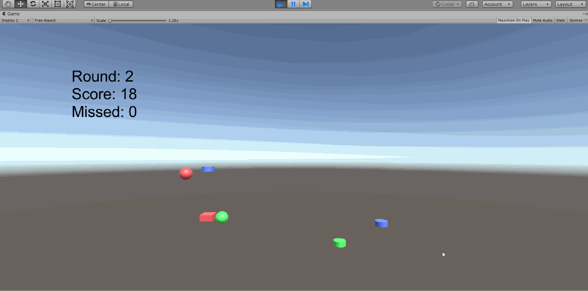

# 3D_HW5
- 张浩轩
- 17343149
- Date: 2019/10/03

## 演示视频
[http://www.iqiyi.com/w_19s9m6k7s5.html](http://www.iqiyi.com/w_19s9m6k7s5.html)



## Hit UFO
**1、编写一个简单的鼠标打飞碟（Hit UFO）游戏**

- 游戏内容要求：  
    - 游戏有 n 个 round，每个 round 都包括10 次 trial；  
    - 每个 trial 的飞碟的色彩、大小、发射位置、速度、角度、同时出现的个数都可能不同。它们由该 round 的 ruler 控制；  
    - 每个 trial 的飞碟有随机性，总体难度随 round 上升；  
    - 鼠标点中得分，得分规则按色彩、大小、速度不同计算，规则可自由设定。  
- 游戏的要求：  
    - 使用带缓存的工厂模式管理不同飞碟的生产与回收，该工厂必须是场景单实例的！具体实现见参考资源 Singleton 模板类  
    - 近可能使用前面 MVC 结构实现人机交互与游戏模型分离

首先我们定义Player类, 用来加载Prefabs并且初始化一些游戏相关的设置, 这个类控制了游戏的整体进度与物体的生成, 代码如下
```c#
public class Player : MonoBehaviour
{
    public GameObject cube;
    public GameObject cylinder;
    public GameObject sphere;

    public Material red;
    public Material green;
    public Material blue;

    public static int score;
    public static int missed;

    public static int round;

    private float T = 1.0f;
    private bool next;

    private float mtime;

    private const float x_min = 1;
    private const float x_max = 15 + 1;
    private const float y_init = -8;

    // Start is called before the first frame update
    void Start()
    {
        score = missed = 0;
        mtime = 0;
        round = 1;
        next = true;
        red = Resources.Load<Material>("Materials/Red");
        green = Resources.Load<Material>("Materials/Green");
        blue = Resources.Load<Material>("Materials/Blue");
        cube = Resources.Load<GameObject>("Prefabs/Cube");
        cylinder = Resources.Load<GameObject>("Prefabs/Cylinder");
        sphere = Resources.Load<GameObject>("Prefabs/Sphere");
        InvokeRepeating("createObject", 0.5f, T);
    }

    // Update is called once per frame
    void Update()
    {
        mtime += Time.deltaTime;
        if (score >= 20) {
            if (round < 3 && next) {
                Invoke("reset", 3);
                CancelInvoke("createObject");
                Invoke("goNext", 3);
                next = false;
            } else CancelInvoke("createObject");
        } else next = true;
    }

    void changeColor(ref GameObject arg) {
        int color = Random.Range(0, 3);
        if (color == 0) arg.GetComponent<Renderer>().material = red;
        else if (color == 1) arg.GetComponent<Renderer>().material = green;
        else arg.GetComponent<Renderer>().material = blue;
    }

    float getPostionX() {
        float x = Random.Range(x_min, x_max);
        if (Random.Range(0, 2) == 0) return x;
        else return -x;
    }

    void createObject() {
        GameObject sth;
        int c = Random.Range(0, 3);
        if (c == 0) sth = cube;
        else if (c == 1) sth = cylinder;
        else sth = sphere;
        sth.transform.position = new Vector3(getPostionX(), y_init, 0);
        changeColor(ref sth);
        sth = GameObject.Instantiate(sth);
        sth.AddComponent<SSActionManager>();
    }

    void reset() {
        score = missed = 0;
        round += 1;
        T /= 2;
    }

    void goNext() {
        InvokeRepeating("createObject", 0, T);
    }
}
```
可以看出, Player在Start()中首先加载了Prefab, 然后InvokeRepeating调用createObject(), 生成随机的物体, **游戏中共有三种形状的物体**, 分别是Cube, Cylinder, Sphere, 也就是长方体, 圆柱, 球体, **并且有三种颜色**, 分别为Red, Green, Blue, 红, 黄, 蓝, 物体出现的形状与颜色都是随机生成的, **共有3 \* 3 = 9种**情况

接下来我们进行动作的管理, 比如鼠标点击产生的效果与物体的运动轨迹等等, 我在SSActionManager种实现此功能, 代码如下
```c#
public class SSActionManager : MonoBehaviour
{
    public float ori_x;
    public float ori_y;
    public float highest_x;
    public float highest_y;

    private float a;
    private float b;
    private float c;

    private float mtime;

    private float x_min;
    private float x_max;
    private float y_min;
    private float y_max;

    // Start is called before the first frame update
    void Start()
    {
        mtime = 0;
        x_min = 0;
        x_max = 10 + 1;
        y_min = 5;
        y_max = 20 + 1;
        ori_x = this.gameObject.transform.position.x;
        ori_y = this.gameObject.transform.position.y;
        highest_x = Random.Range(x_min, x_max);
        if (Random.Range(0, 2) == 0) highest_x = -highest_x;
        highest_y = Random.Range(y_min, y_max);
        while(Mathf.Abs(highest_x - ori_x) < 1) {
            highest_x = Random.Range(x_min, x_max);
        }

        float x2 = 2 * highest_x - ori_x, y2 = ori_y;
        float temp = (highest_y - y2) / (highest_x - x2);
        a = (ori_y - temp * ori_x - y2 + temp * x2) / (ori_x * ori_x - ori_x * (highest_x + x2) - x2 * x2 + x2 * (highest_x + x2));
        b = -2 * a * highest_x;
        c = y2 - a * (x2 * x2) - b * x2;
    }

    // Update is called once per frame
    void Update()
    {
        Vector3 pos = this.gameObject.transform.position;
        if (ori_x < highest_x) pos.x += Time.deltaTime;
        else pos.x -= Time.deltaTime;
        float x = pos.x;
        pos.y = a * Mathf.Pow(x, 2) + b * x + c;
        //Debug.Log("x: " + x + ", y: " + pos.y + ", ori_x: " + ori_x + ", ori_y: " + ori_y + ", h_x: " + highest_x + ", h_y: " + highest_y + ", a: " + a + ", b: " + b + ", c: " + c);
        this.gameObject.transform.position = pos;
        mtime += Time.deltaTime;
        if (pos.y < -20) {
            Destroy(this.gameObject);
            Player.missed += 1;
        }
        if (Player.score >= 20) Destroy(this.gameObject);
    }

    void OnMouseDown() {
        Destroy(this.gameObject);
        Player.score += 1;
    }
}
```
此类用来管理鼠标动作与控制物体的运动轨迹.
最后我们只需要再实现一个管理UI界面的类即可
```c#
private void OnGUI() {
    GUI.Label(new Rect(Screen.width / 8, Screen.height / 6, 200, 100), "Round: " + Player.round + "\nScore: " + Player.score + "\nMissed: " + Player.missed, style);
    if(Player.round >= 3 && Player.score >= 20) {
        GUI.Label(new Rect(Screen.width / 2 - 100, Screen.height / 2 - 100, 200, 200), "You win!", style);
    }else if(Player.score >= 20) {
        GUI.Label(new Rect(Screen.width / 2 - 200, Screen.height / 2 - 100, 200, 200), "Next round will start after 3s", style);
    }
}
```
此游戏共有**3个Round**, 每个回合只需要**保证最终的Score大于等于20并且Missed小于等于10即可通关**.

